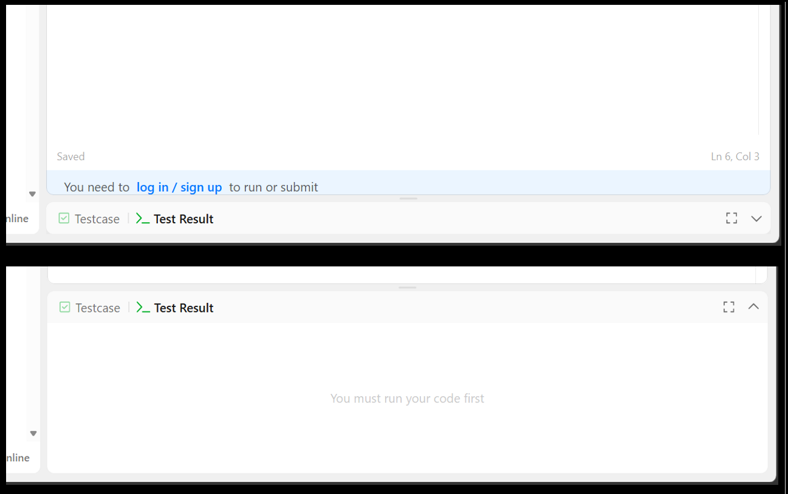
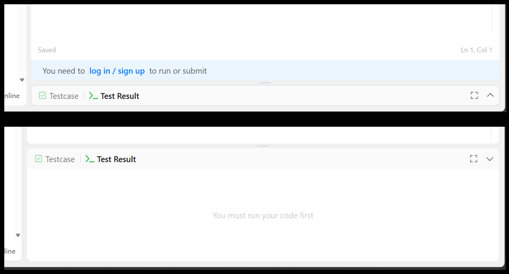

# LeetCode Arrow Fix

It drives me crazy that LeetCode's default layout has the bottom right panel fold/unfold arrows pointing the wrong way.

- Arrows should point up when you want to unfold/maximize the tab.
- Arrows should point down when you want to fold/minimize the tab.

This extension flips them so they match what you'd expect.

| Before | After |
|--------|-------|
|  |  |

## Install

1. Clone or download this repo
2. Open `edge://extensions`
3. Turn on **Developer mode**
4. Click **Load unpacked** and select this folder

Works only on `leetcode.com/problems/*`
